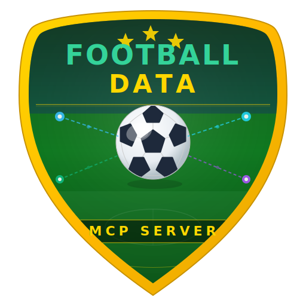

<p align="center">
  
</p>

<h1 align="center">⚽ Football Data MCP Server</h1>

[](https://github.com/bhayanak/football-data-mcp-server/actions/workflows/ci.yml)
[](LICENSE)

A **Model Context Protocol (MCP) server** that gives AI assistants (GitHub Copilot, Claude, etc.) real-time access to **football (soccer) data** via the [football-data.org](https://www.football-data.org/) API.

> 🏟️ Live scores • 📊 Standings • 👤 Players • ⚽ Top scorers • 🏆 50+ leagues worldwide

---

## 📦 Packages

| Package | Description | Docs |
|---------|-------------|------|
| [`football-data-mcp-server`](packages/football-data-server/) | MCP server (npm package, standalone CLI) | [Server README](packages/football-data-server/README.md) |
| [`football-data-mcp-extension`](packages/football-data-vscode-extension/) | VS Code extension (one-click install) | [Extension README](packages/football-data-vscode-extension/README.md) |

## 🛠️ MCP Tools (9 Total)

| Tool | Description |
|------|-------------|
| `fb_list_competitions` | List available leagues, cups, and tournaments |
| `fb_get_competition` | Get competition details |
| `fb_get_matches` | Get matches by competition, date, status, or matchday |
| `fb_get_match` | Get detailed match info with scores and referees |
| `fb_get_standings` | League table with points, goals, form |
| `fb_get_team` | Team info, squad, coach, venue |
| `fb_get_team_matches` | Team's upcoming and past matches |
| `fb_get_player` | Player profile and statistics |
| `fb_get_scorers` | Top scorers by competition |

## 🏁 Quick Start

### Option 1: VS Code Extension (Recommended)

1. Install the extension from VS Code Marketplace
2. Set your API key in VS Code settings: **Football Data MCP > API Key**
3. Get a free API key at [football-data.org](https://www.football-data.org/client/register)
4. Start chatting with your AI assistant about football!

### Option 2: Standalone MCP Server

```bash
npm install -g football-data-mcp-server
```

```json
{
  "mcpServers": {
    "football-data": {
      "command": "football-data-mcp-server",
      "env": {
        "FOOTBALL_MCP_API_KEY": "your-api-key"
      }
    }
  }
}
```

## ⚖️ License

[MIT](LICENSE)
