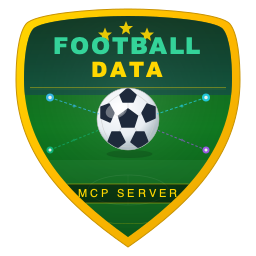

<p align="center">
  
</p>

<h1 align="center">⚽ Football Data MCP Server</h1>

[](https://www.npmjs.com/package/football-data-mcp-server)
[](../../LICENSE)

A **Model Context Protocol (MCP) server** providing AI assistants with real-time football (soccer) data from [football-data.org](https://www.football-data.org/) API v4.

Covers **50+ leagues** including Premier League, La Liga, Bundesliga, Serie A, Ligue 1, Champions League, and more.

---

## 📦 Installation

### npm (global)

```bash
npm install -g football-data-mcp-server
```

### npx (no install)

```bash
npx football-data-mcp-server
```

---

## ⚙️ Configuration

Get a free API key at [football-data.org/client/register](https://www.football-data.org/client/register) (10 requests/minute).

### Environment Variables

| Variable | Required | Description | Default |
|----------|----------|-------------|---------|
| `FOOTBALL_MCP_API_KEY` | **Yes** | API token from football-data.org | — |
| `FOOTBALL_MCP_BASE_URL` | No | API base URL | `https://api.football-data.org/v4` |
| `FOOTBALL_MCP_CACHE_TTL_MS` | No | Cache TTL for general data (ms) | `60000` (1 min) |
| `FOOTBALL_MCP_STANDINGS_TTL_MS` | No | Cache TTL for standings (ms) | `300000` (5 min) |
| `FOOTBALL_MCP_CACHE_MAX_SIZE` | No | Max cached responses | `100` |
| `FOOTBALL_MCP_TIMEOUT_MS` | No | HTTP request timeout (ms) | `10000` |
| `FOOTBALL_MCP_RATE_LIMIT` | No | Max requests per minute | `10` |

### MCP Client Configuration

#### Claude Desktop / Copilot

```json
{
  "mcpServers": {
    "football-data": {
      "command": "football-data-mcp-server",
      "env": {
        "FOOTBALL_MCP_API_KEY": "your-api-key"
      }
    }
  }
}
```

#### Using npx

```json
{
  "mcpServers": {
    "football-data": {
      "command": "npx",
      "args": ["-y", "football-data-mcp-server"],
      "env": {
        "FOOTBALL_MCP_API_KEY": "your-api-key"
      }
    }
  }
}
```

---

## 🛠️ Tools (9 Total)

### Competitions
| Tool | Description |
|------|-------------|
| `fb_list_competitions` | List available leagues, cups, and tournaments. Filter by area/country. |
| `fb_get_competition` | Get detailed info about a specific competition. |

### Matches
| Tool | Description |
|------|-------------|
| `fb_get_matches` | Get matches by competition, date range, status, or matchday. Live scores included. |
| `fb_get_match` | Get detailed match info: scores, half-time, referees, status. |

### Standings
| Tool | Description |
|------|-------------|
| `fb_get_standings` | League table with position, points, wins, draws, losses, goals, form. |

### Teams
| Tool | Description |
|------|-------------|
| `fb_get_team` | Team info: squad, coach, venue, running competitions. |
| `fb_get_team_matches` | Team's scheduled and finished matches. |

### Players & Scorers
| Tool | Description |
|------|-------------|
| `fb_get_player` | Player profile: position, nationality, team, shirt number. |
| `fb_get_scorers` | Top scorers by competition: goals, assists, penalties, matches played. |

---

## ⚖️ License

[MIT](../../LICENSE)
